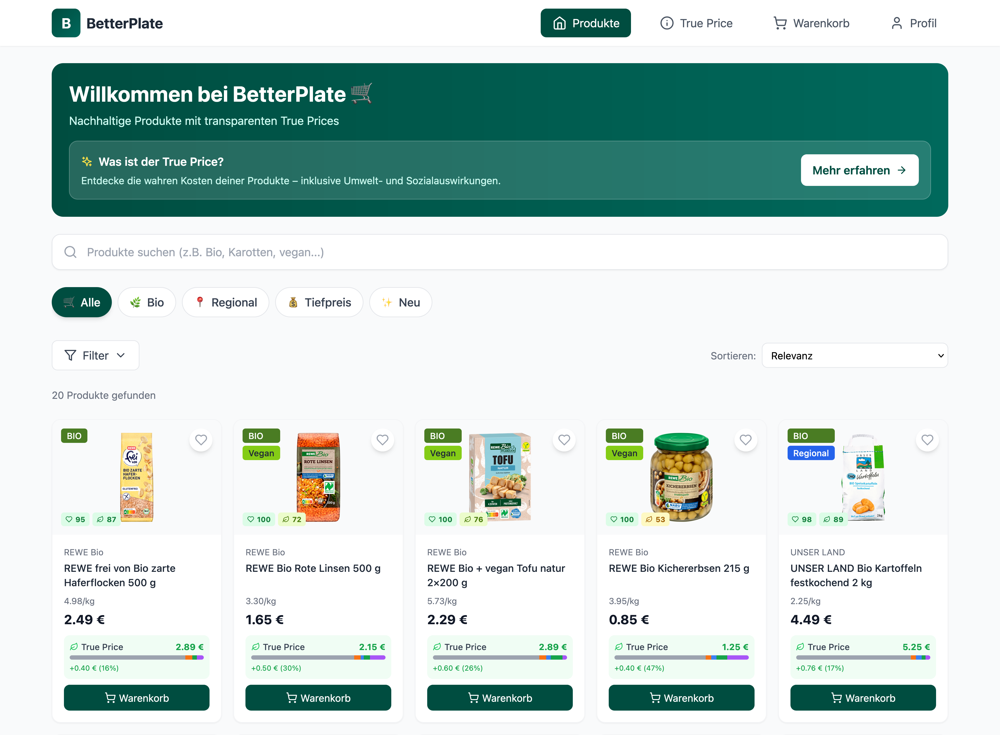
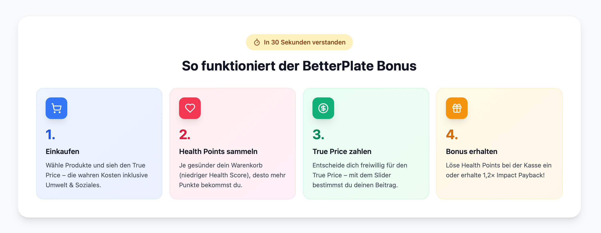
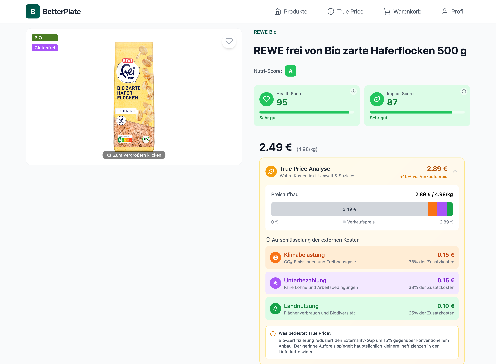
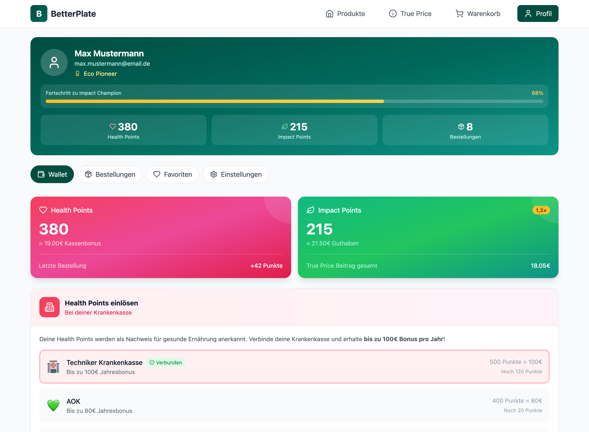

<p align="center">
  
</p>

<h1 align="center">🌱 BetterPlate</h1>

<p align="center">
  <strong>Make every purchase count. Shop consciously, live sustainably.</strong>
</p>

<p align="center">
  <em>A grocery delivery platform that reveals the true cost of food and empowers consumers to make healthier, more sustainable choices — while being rewarded for it.</em>
</p>

<p align="center">
  <strong>⚠️ This is a concept prototype, not a live product.</strong><br />
  Developed as part of the <a href="https://www.unternehmertum.de/">UnternehmerTUM</a> Innovation Sprint program.
</p>

---

## 🌍 The Problem We're Solving

Every time we buy groceries, we pay only part of the real cost. The prices on the shelf don't reflect the environmental damage, the underpaid workers, the water pollution, or the CO₂ emissions caused during production. These **hidden costs** — called externalities — are paid by society, our planet, and future generations.

**The result?**
- Unsustainable products appear artificially cheap
- Consumers have no visibility into the true impact of their choices
- Sustainable alternatives struggle to compete on price
- The disconnect between consumer behavior and environmental impact grows

**BetterPlate changes this.**

---

## 💡 Our Vision

We believe that **informed consumers make better choices** — and better choices, made by millions, can transform our food system.

BetterPlate is not just another grocery delivery app. It's a platform built on **transparency, education, and positive reinforcement**. We want to:

1. **Make the invisible visible** — Show the true environmental and social costs of every product
2. **Reward sustainable behavior** — Turn conscious shopping into tangible benefits
3. **Empower, not guilt** — Help users improve gradually, without judgment
4. **Bridge the gap** — Connect sustainable choices with real-world rewards through health insurance partnerships

---

## 🎯 How It Works

### True Price Transparency

Every product on BetterPlate displays two prices:
- **Retail Price**: What you pay at checkout
- **True Price**: The actual cost including environmental and social externalities

<p align="center">
  
</p>

The **True Price Gap** is broken down into four categories:
- 🌡️ **Climate Impact** — CO₂ emissions and greenhouse gases
- 💧 **Water Usage** — Water consumption and pollution
- 🌳 **Land Use** — Deforestation and biodiversity loss
- 👥 **Social Costs** — Fair wages and working conditions

This isn't about making you feel guilty — it's about giving you the **power to understand** what you're really buying.

---

### The BetterPlate Scoring System

Every product and every cart receives two scores:

#### 🍎 Health Score (0-100)
Based on nutritional value, Nutri-Score, and ingredient quality. Higher scores mean healthier choices for you and your family.

#### 🌱 Impact Score (0-100)
Measures environmental and social sustainability. Higher scores mean better choices for the planet and communities.

<p align="center">
  
</p>

---

### True Price Contribution — Close the Gap, Make a Difference

Here's where it gets interesting. When you check out, you can choose to **voluntarily contribute** to close the True Price Gap:

- **0%**: Pay only the retail price
- **25%**: Cover a quarter of the hidden costs
- **50%**: Meet halfway
- **100%**: Pay the full true price

Your contribution goes directly to **certified sustainability projects** that offset the externalities:
- Climate compensation through verified carbon offset programs
- Water restoration projects
- Reforestation and biodiversity initiatives
- Fair wage programs for farmers and workers

**The more you contribute, the higher your Impact Score — and the more rewards you earn.**

---

### 🏆 BetterPlate Bonus — Get Rewarded for Good Choices

This is what makes BetterPlate unique. Your Health Score and Impact Score aren't just numbers — they translate into **real-world rewards**:

<p align="center">
  
</p>

#### Health Insurance Partnerships
Partner health insurances (like TK, AOK, Barmer) reward healthy eating:
- **Health Points** can be redeemed for bonus payments, premium reductions, or wellness programs
- The healthier your shopping patterns, the more you save on health insurance

#### Sustainability Cashback
- **Impact Points** can be converted to store credit
- Higher True Price contributions earn bonus multipliers
- Consistent sustainable shopping unlocks premium rewards

#### Progress Tracking
- See your shopping history and how your scores have evolved
- Monthly and yearly statistics on your personal impact
- Comparison with community averages

---

## 🧭 Our Philosophy

### Transparency Over Marketing

We don't hide behind vague "eco-friendly" labels. Every claim is backed by data:
- True Price calculations based on scientific externality research
- Clear breakdowns showing exactly where hidden costs come from
- No greenwashing — even our "best" products still have some impact

### Progress Over Perfection

We know you can't change overnight. BetterPlate is designed for **gradual improvement**:
- Smart recommendations suggest slightly better alternatives
- No shame for buying conventional products
- Celebrate small wins and incremental progress

### Individual Action, Collective Impact

One person switching to sustainable products might seem small. But when thousands do it:
- Demand shifts toward sustainable producers
- Farmers see that sustainability is profitable
- Supply chains adapt to meet new expectations
- Real systemic change becomes possible

---

## 🛒 Features at a Glance

| Feature | Description |
|---------|-------------|
| **True Price Display** | See retail + true price for every product |
| **Impact Breakdown** | Understand climate, water, land, and social costs |
| **Health Score** | Nutritional rating based on Nutri-Score and ingredients |
| **Impact Score** | Sustainability rating for environmental footprint |
| **True Price Slider** | Choose how much of the gap you want to cover |
| **Smart Recommendations** | AI-powered suggestions for healthier/greener swaps |
| **Cart Sustainability Summary** | See your entire cart's aggregated impact |
| **Reward Wallet** | Track and redeem Health & Impact Points |
| **Insurance Integration** | Connect with partner health insurances |
| **Flexible Delivery** | Choose eco-friendly delivery time slots |

---

## 🔬 The Science Behind True Pricing

True Cost Accounting (TCA) is a methodology that calculates the hidden costs of food production. Our True Price calculations are based on established research from:

- **True Price Foundation** — Pioneering true cost methodology
- **FAO (Food and Agriculture Organization)** — Agricultural impact data
- **IPCC** — Climate change emission factors
- **Water Footprint Network** — Water usage assessments
- **ILO (International Labour Organization)** — Social cost frameworks

The externality costs are calculated across the entire supply chain: farming, processing, transportation, and retail.

---

## 🚀 Getting Started

### Prerequisites

- Node.js 18+
- npm or yarn

### Installation

```bash
# Clone the repository
git clone https://github.com/yourusername/betterplate.git

# Navigate to the project
cd betterplate

# Install dependencies
npm install

# Start the development server
npm run dev
```

### Tech Stack

- **Frontend**: React 18 with Vite
- **Styling**: Tailwind CSS
- **Routing**: React Router v6
- **Icons**: Lucide React
- **State Management**: React Context API

---

<p align="center">
  <strong>Every purchase is a vote for the world you want to live in.</strong>
  <br />
  <em>Choose wisely. Choose BetterPlate.</em>
</p>

<p align="center">
  🌱 Made with 💚 for a sustainable future
</p>
